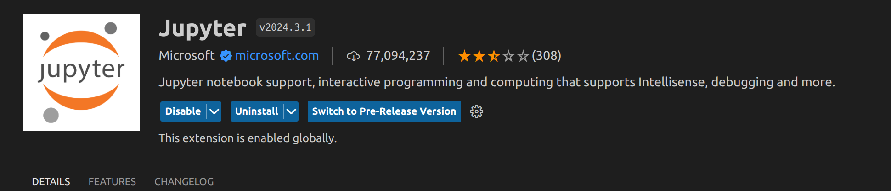
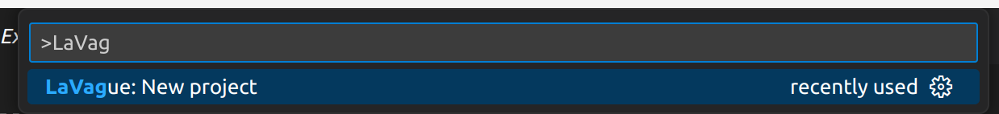
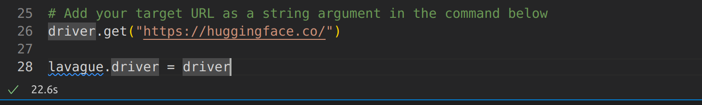
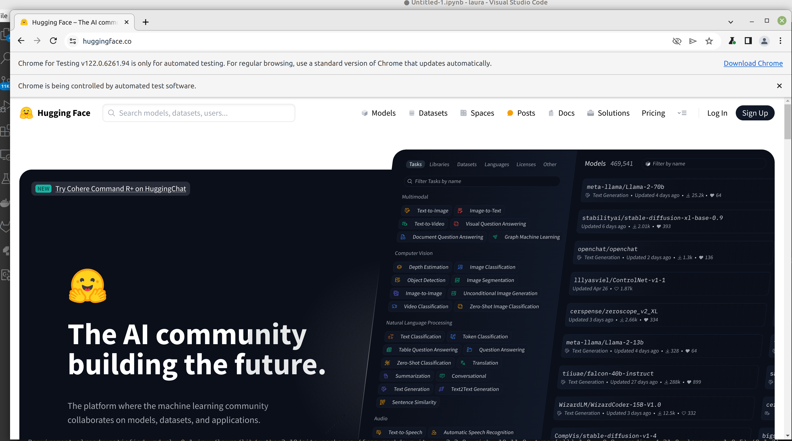
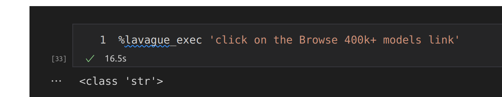
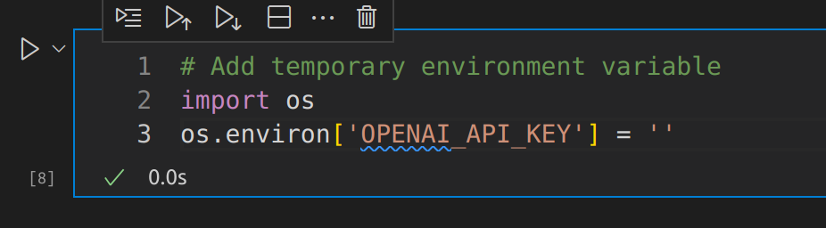
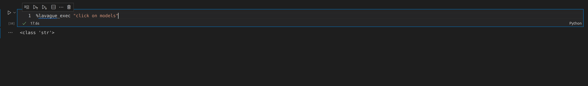
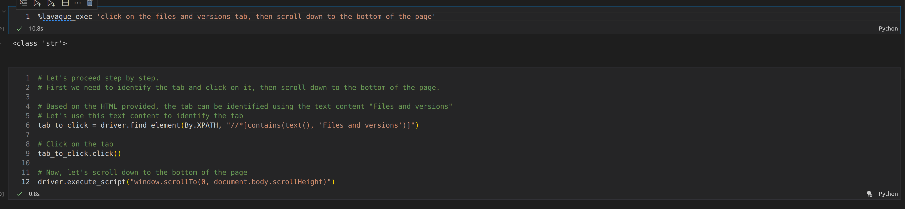
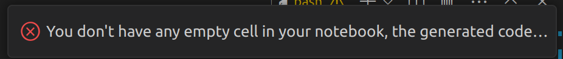
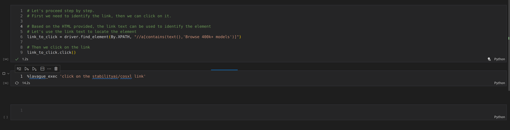

  
  <h1>Welcome to the LaVague VsCode Extension</h1>
  
🪄 Copilot for automating automation

<h1></h1>

## 🌊 What is LaVague?

The LaVague VsCode extension is an **open-source** project designed to automate automation for devs! 

It enables you to leverage AI to turn your **natural language instructions** into Python code for automation leveraging **Selenium**.

Behind the scenes, we use **advanced AI techniques** (RAG, Few-shot learning, Chain of Thought) to enhance performance - check out [our documentation to find out more](https://docs.lavague.ai/en/latest/)!

## 🔧 Pre-requisites

To use our VsCode extension you will need:

- A version of VsCode >= 1.80

- The Jupyter notebooks VsCode extension

- You will also need to install the chrome webdriver & LaVague. You can do this by running our `setup.sh` LaVague installation script [available here](https://github.com/lavague-ai/LaVague)

See the LaVague installation instructions [for more details](https://docs.lavague.ai/en/latest/docs/get-started/setting-up-la-vague/)!

## 🏄‍♀️ Getting started

To get started with LaVague:

- Open a new LaVague project. You can do this by opening the VSCode Command Palette with Ctrl+Shift+P

- Type or search and find the 'LaVague: New project' command

This will open a new LaVague Jupyter notebook file in VsCode with some pre-filled cells of code.

- Add the URL you wish to generate automation code for in the first cell block

If we run this first block of code, we can see a new VsCode window opens displaying our target site:

We're now ready to add an instruction for the action we'd like to automate:

> Note you will need to have an OpenAI API key set in your notebook environment. If you don't have yours set in this environment, you can add the following code into a cell:

Your automation code will populate the next cell.

By running this cell, we can now see the result of our automation code:

> Note, it is possible to put a sequence of actions into one set of instructions as follows:

⚠️ Note the extension always expects the cell following the cell with our `%lavague-exec` command to be empty so it can populate it with the generated automation code. 

If you don't have an empty cell, you will see the following error:

Therefore, to run a new command now, we can move the previous generated code above our `%lavague-exec` command:

## 🙋 Get support

You can report a bug by opening a [new issue](https://github.com/lavague-ai/lavague-vscode/issues) on our GitHub repo. We regularly track bug reports and try to respond as soon as possible!

You can also chat with us on our [Discord server](https://discord.com/invite/SDxn9KpqX9)!